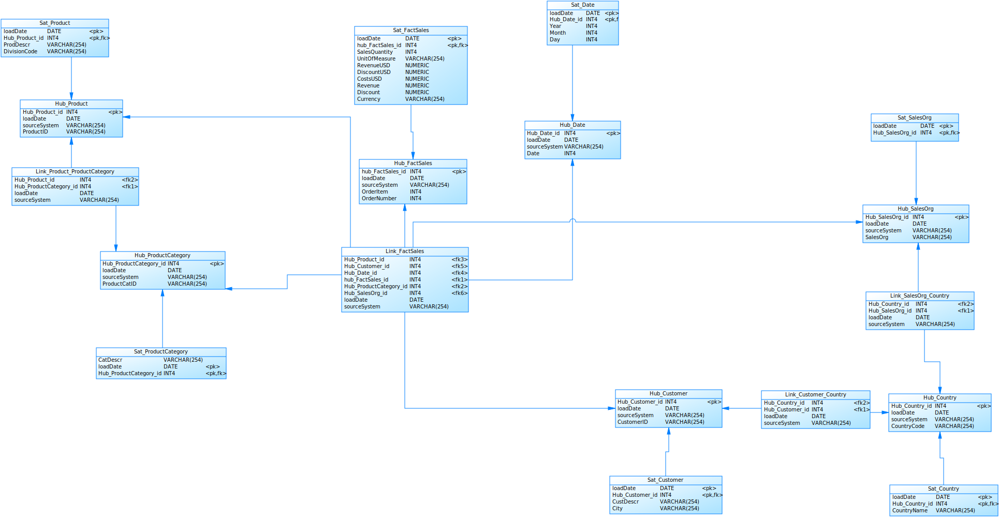
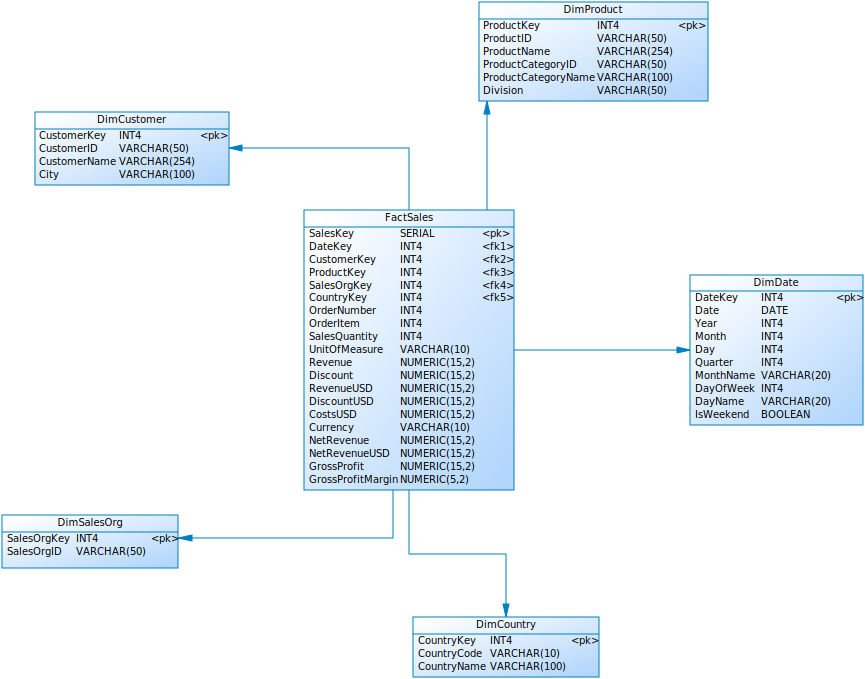

# Praktikum 2: Von den operativen Daten über einen Data Vault zum Auswerte-Mart

## Aufgabe 1: Data Vault Modellierung

### 1.1 Ausgangssituation

Die Ausgangsdaten liegen in der Datei `SalesData.csv` vor, die **171.011 Transaktionsdatensätze** des Unternehmens "Global Bike" enthält.

**Besonderheiten der Datenquelle:**
- Delimiter: Semikolon (`;`), Dezimaltrennzeichen: Komma (`,`)
- Datumsformat: `dd.mm.yy`
- Inkonsistente Ländercodes: GER, DEU, DE für Deutschland; USA, U.S., US für USA
- Gemischte Währungsschreibweisen: EUR, €, USD

### 1.2 Data Vault Modell

Das entwickelte Data Vault Modell folgt der Data Vault 2.0 Methodologie mit **7 Hubs**, **4 Links** und **7 Satellites**:



**Modellstruktur:**
- **Hubs** (7): HubCountry, HubCustomer, HubDate, HubFactSales, HubProduct, HubProductCategory, HubSalesOrg
- **Links** (4): LinkCustomerCountry, LinkFactSales, LinkProductProductCategory, LinkSalesOrgCountry
- **Satellites** (7): SatCountry, SatCustomer, SatDate, SatFactSales, SatProduct, SatProductCategory, SatSalesOrg

**Zentrale Link-Tabelle (LinkFactSales)** verbindet alle Geschäftsobjekte einer Verkaufstransaktion.

### 1.3 Datentransformationen

Im ETL-Prozess (`etl_salesdata.py`) wurden folgende Normalisierungen durchgeführt:

**Ländercode-Normalisierung:**
- GER, DEU → DE
- USA, U.S. → US
- Ergänzung Ländernamen: DE → Germany, US → United States

**Währungsnormalisierung:**
- €, EURO → EUR
- USD bleibt USD

**Surrogate Key Generierung:**
- Stabile IDs via Pandas Factorization (`pd.factorize(sort=True)`)
- Deterministische ID-Vergabe für reproduzierbare Ergebnisse

### 1.4 ETL-Ergebnisse

Nach erfolgreicher ETL-Ausführung wurden **522.479 Datensätze** in die Data Vault geladen:

| Schicht | Anzahl Tabellen | Gesamtzeilen |
|---------|-----------------|--------------|
| **Hubs** | 7 | 175.706 |
| **Links** | 4 | 171.067 |
| **Satellites** | 7 | 175.706 |

**Technische Umsetzung:**
- Python 3.14 mit pandas 2.3.3, SQLAlchemy 2.0.44, psycopg2-binary 2.9.11
- PostgreSQL 9.x Datenbank
- Bulk-Insert mit `to_sql(method='multi', chunksize=5000)`

## Aufgabe 2: Sales Mart (Star Schema)

### 2.1 Star Schema Design

Aus dem Data Vault wurde ein denormalisiertes Star Schema für analytische Abfragen erstellt:



**Star Schema Struktur:**
- **Faktentabelle**: FactSales mit direkten Referenzen zu allen Dimensionen
- **Dimensionen** (5): DimDate, DimCustomer, DimProduct, DimSalesOrg, DimCountry

**Besonderheit:** Alle Dimensionen verbinden sich **direkt** mit der Faktentabelle (echtes Star Schema, kein Snowflake). Country ist eine eigenständige Dimension mit direkter Verbindung zu FactSales.

### 2.2 Berechnete Kennzahlen

Die FactSales-Tabelle enthält vordefinierte Kennzahlen:

| Kennzahl | Formel |
|----------|--------|
| **NetRevenue** | Revenue - Discount |
| **NetRevenueUSD** | RevenueUSD - DiscountUSD |
| **GrossProfit** | NetRevenueUSD - CostsUSD |
| **GrossProfitMargin** | (GrossProfit / NetRevenueUSD) × 100 |

### 2.3 ETL Data Vault → Sales Mart

Die Transformation erfolgt via SQL-Skript (`etl_dv_to_mart.sql`):

**Dimensionen laden:**
- DimDate: Aus HubDate + SatDate mit Kalenderattributen (Year, Month, Quarter, DayOfWeek, IsWeekend)
- DimCountry: Aus HubCountry + SatCountry
- DimCustomer: Aus HubCustomer + SatCustomer (ohne Country-Denormalisierung)
- DimProduct: Aus HubProduct + SatProduct + HubProductCategory + SatProductCategory (mit Category-Denormalisierung)
- DimSalesOrg: Aus HubSalesOrg (ohne Country-Denormalisierung)

**Faktentabelle laden:**
- CountryKey wird aus LinkSalesOrgCountry geholt und direkt in FactSales eingefügt
- Alle Kennzahlen werden während des INSERT berechnet

**Ausführung:**
```
psql -U postgres -d postgres -f sales_mart.sql
psql -U postgres -d postgres -f etl_dv_to_mart.sql
```
