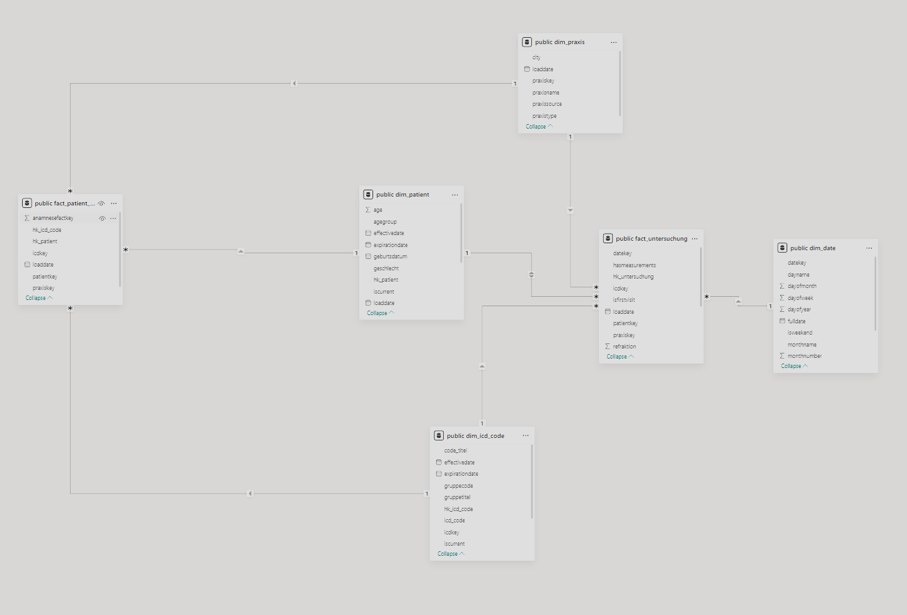
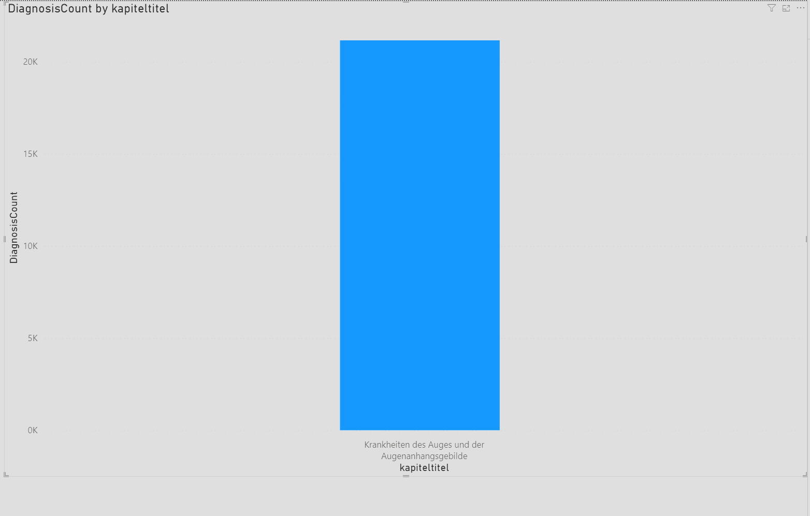
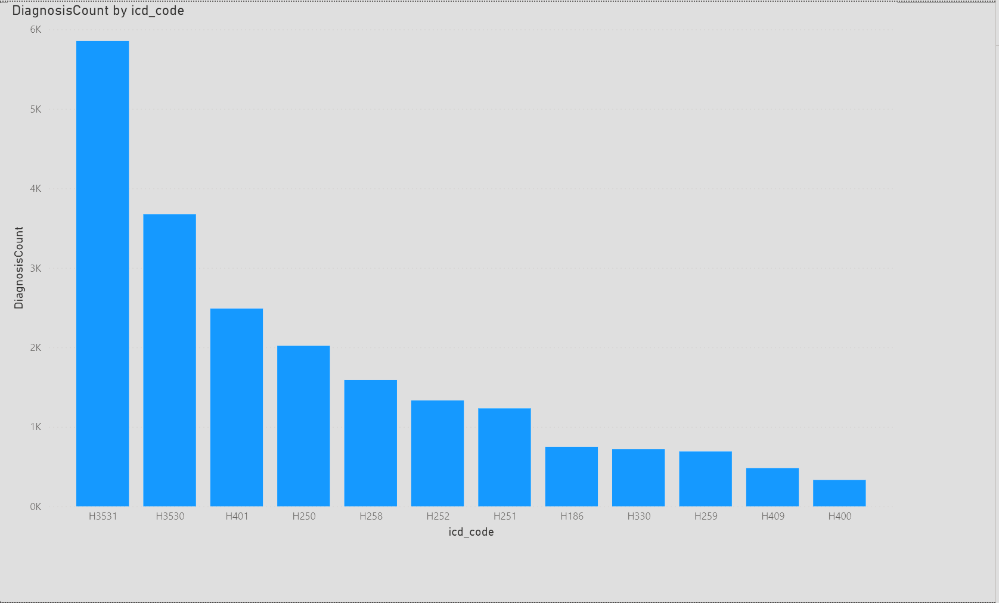
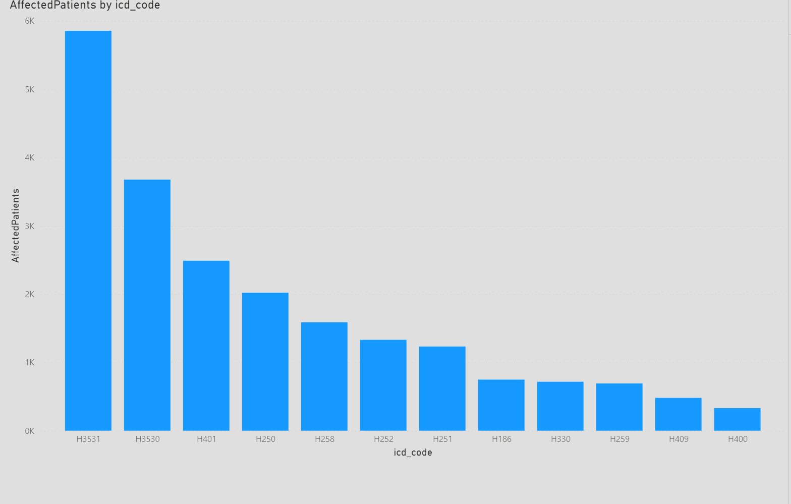
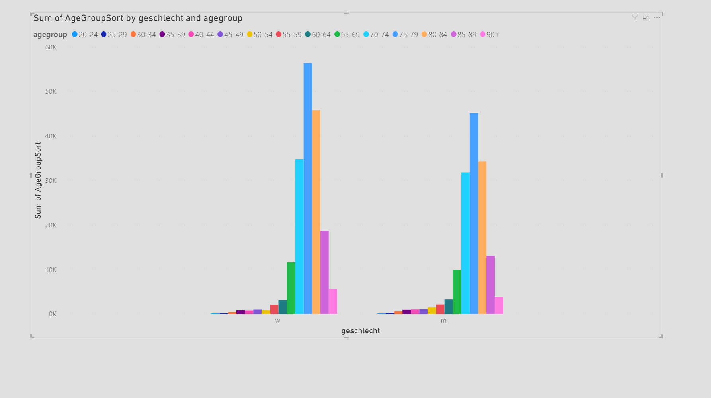

# Praktikum 4 - Gruppe 10

## Data Vault to Data Mart - ETL Pipeline

This project transforms data from the Data Vault schema (Praktikum 3) into a dimensional model (Star Schema) optimized for analytical queries and business intelligence reporting.

## From Data Vault to Star Schema

In Praktikum 3, we built a Data Vault model that preserves data lineage and handles multiple sources. Now we transform this into a dimensional model for better query performance and easier analytics.

## Dimensional Model Overview



Our Star Schema consists of:

### Dimension Tables

**Dim_Date** - Time dimension for temporal analysis
- DateKey (PK), FullDate, DayOfWeek, DayName
- Week, Month, Quarter, Year
- IsWeekend flag for working day analysis

**Dim_Praxis** - Practice/Clinic locations
- PraxisKey (PK), PraxisSource, PraxisName
- PraxisType (Praxis vs Uniklinik), City
- Tracks all 9 Praxis locations + 2 University Clinics

**Dim_Patient** - Patient master data with SCD Type 2
- PatientKey (PK), HK_Patient, PatientID, PatientSource
- Demographic data: Name, Birth date, Gender, Insurance
- **AgeGroup**: 5-year blocks (0-4, 5-9, 10-14, ..., 85-89, 90+)
- EffectiveDate, ExpirationDate, IsCurrent for slowly changing dimensions

**Dim_ICD_Code** - Denormalized ICD hierarchy
- ICDKey (PK), HK_ICD_Code, ICD_Code, Code_Titel
- **Hierarchy**: Kapitel → Gruppe → Code (flattened)
- EffectiveDate, IsCurrent for version tracking

### Fact Tables

**Fact_Untersuchung** - Examination facts (grain: one examination)
- Links to: Patient, ICD Code, Date, Praxis
- Measurements: Tensio, Refraktion, Visus
- **IsFirstVisit**: Flag for first-time patient visits (Aufgabe 2c)
- HasMeasurements: Flag indicating if any measurements were taken

**Fact_Patient_Anamnese** - Medical history facts (grain: patient-diagnosis pair)
- Links to: Patient, ICD Code, Praxis
- Tracks pre-existing conditions from medical history
- No date dimension (anamnese data has no timestamps)

## ETL Pipeline

### Step 1: Populate Dim_Date
Generate date records for the range 2015-2030 with all temporal attributes (day, week, month, quarter, year).

### Step 2: Populate Dim_Praxis
Extract unique practice/clinic sources from `Hub_Patient.PatientSource`:
- Parse source name to extract city and type
- Distinguish between Praxis and Uniklinik
- Create readable names: "Praxis Coesfeld", "Universitätsklinikum Münster"

### Step 3: Populate Dim_ICD_Code
Denormalize the ICD hierarchy from Data Vault:
```sql
Hub_ICD_Kapitel → Link_Kapitel_Gruppe → Hub_ICD_Gruppe 
    → Link_Gruppe_Code → Hub_ICD_Code
```
Result: Single row with Kapitel, Gruppe, and Code information (flattened)

### Step 4: Populate Dim_Patient
Transform patient data with age calculations:
- Get latest `Sat_Patient_Stammdaten` for each patient
- Calculate **AgeGroup** in 5-year blocks using birth date
- Calculate actual Age for detailed analysis
- Mark as IsCurrent = TRUE (SCD Type 2 ready)

### Step 5: Populate Fact_Untersuchung
Load examination facts with measurements:
- Join Hub_Untersuchung → Link_Patient_Untersuchung → Hub_Patient
- Get latest `Sat_Untersuchung` (date) and `Sat_Messwerte` (measurements)
- Link to dimensions via foreign keys
- Calculate **IsFirstVisit** by comparing with earliest examination date
- Join to first diagnosis via `Link_Untersuchung_Diagnose`

### Step 6: Populate Fact_Patient_Anamnese
Load medical history facts:
- Extract from `Link_Patient_Anamnese`
- Link to Patient, ICD Code, and Praxis dimensions
- Represents pre-existing conditions separate from examination diagnoses

## Analytical Views

Pre-built views for common analytics:

- `vw_First_Visit_Only` - First examinations only (Aufgabe 2c)
- `vw_Patient_Examination_Summary` - Complete patient examination details
- `vw_Measurements_By_AgeGroup` - Average measurements grouped by age
- `vw_Anamnese_Diagnose_Correlation` - Medical history vs diagnosis patterns
- `vw_Versicherung_Distribution` - Insurance distribution by practice type

## Power BI Analytics

### Diagnosis Count by ICD Kapitel



Shows the distribution of diagnoses across ICD chapters. Most common categories are eye-related conditions (Kapitel VII - Krankheiten des Auges).

### Diagnosis Count by ICD Code



Detailed breakdown of top diagnoses at the code level, showing which specific conditions are most prevalent.

### Affected Patients Analysis



Shows number of unique patients affected by each diagnosis, useful for understanding disease prevalence vs frequency.

### Age Group Distribution



Patient distribution across 5-year age groups, revealing demographic patterns in the patient population.

## Power BI DAX Measures

Key calculated measures for Power BI:

```dax
DiagnosisCount = 
CALCULATE(
    COUNT('public fact_untersuchung'[UntersuchungFactKey]),
    NOT(ISBLANK('public fact_untersuchung'[ICDKey])),
    'public dim_icd_code'[IsCurrent] = TRUE
)
```

```dax
AffectedPatients = 
CALCULATE(
    DISTINCTCOUNT('public fact_untersuchung'[PatientKey]),
    NOT(ISBLANK('public fact_untersuchung'[ICDKey])),
    'public dim_icd_code'[IsCurrent] = TRUE
)
```

These measures filter for:
- Valid diagnoses (ICDKey is not blank)
- Current ICD code versions only
- Count examinations vs unique patients

