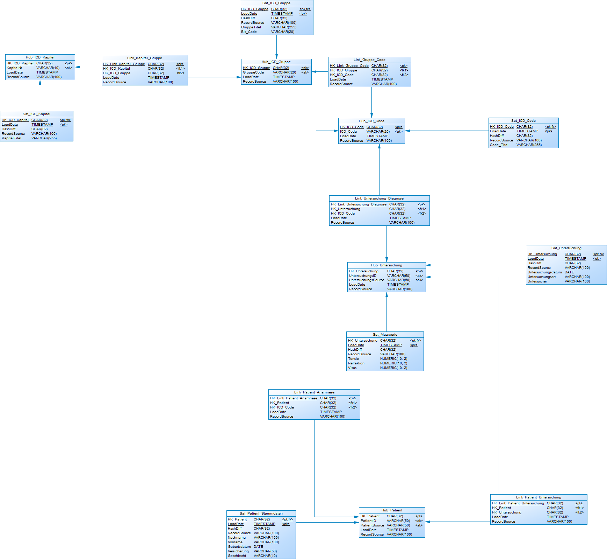
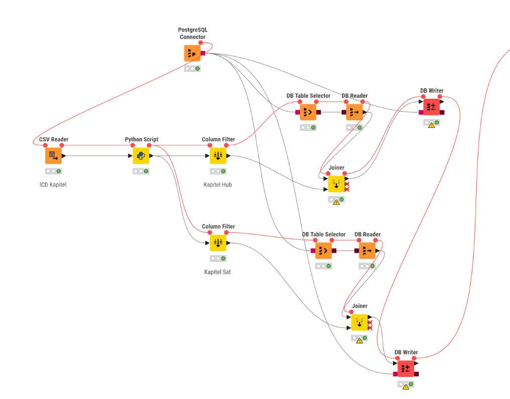
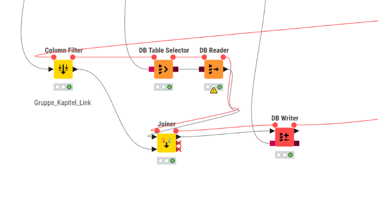
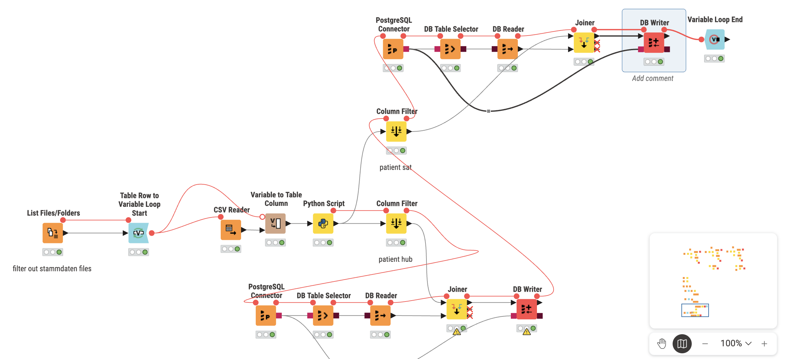

# Praktikum 3 - Gruppe 10

## Known Problem with first edition data vault model


With this current physical data model, the problem with this model is that there is no unified patient key, and data is still separated by origin.

Die Daten sollen im Data Warehouse mit einem einheitlichen Patientenschlüssel zusammengelegt und nicht mehr nach Herkunft getrennt werden => Data should be merged with an unified patient key and no longer separated by origin

Current schema: 
```
CONSTRAINT UQ_Hub_Patient UNIQUE (PatientID, PatientSource)
```

This mean:
- Patient "12345" from praxis_coesfeld => Hub entry 1
- Patient "12345" from uniklinik_saarland => Hub entry 2

Even if this is the same person, they remain separated in this data vault schema

### Proposed solution?

**Unified Patient**: If the same person visit different kliniks, how do we know that it's the same person?
- This is the fundamental problem, normally this would be easier if we have
1. Versicherungssnummer
2. Echte ID Nummer
3. Adresse oder Postanschrift
Currently we have none of these here, What is the chance of 2 People having the same name and same birthday?
This is why we would still go for levenshtein algorithm, but in the end we didn't populate the table patient_master hub link sat because it's a bit complicated

## Knime Workflow

### Hub and Sat
Currently for the hub and satelitte we are using this workflow for ICD Gruppe, Codes and Kapitel
To keep this simple, the table codes will only save the code and code description, other value with unknown description will not be saved




### Link

After inserting Hub and Sat, the last thing we need to insert is Link tables, which is as followed:




### Patient
Now that we are done with ICD data, the next thing would be data from patients from different Praxis and Klinik

We could reuse the same component for filtering row, db connect and reader and joiner for writing into database

To create a loop for each type of data from different Praxis/Klinik, we use List Files/Folder and Table Row to Variable Loop Start + Loop End Nodes to create a loop

Basically it will loop through all Stammdaten files (from all Praxis/Klinik) in the folder and execute the ETL pipeline




The workflow is basically the same across hub patient, hub untersuchung, sat messwert, etc... 

The differences are the python scripts and what Row Filter nodes filter out

If you want to see the full data pipeline in knime, you can load the MLOPS.knwf into KNIME

## Data Sources

The project processes data from multiple sources:
- **9 Praxis locations**: Coesfeld, Hamm, Neunkirchen, Pirmasens, St. Wendel, Telgte, Unna, Warendorf, Zweibrücken
- **University Clinics**: Münster and Saarland
- **ICD Data**: Codes, Gruppen (Groups), and Kapitel (Chapters)

For each praxis/clinic, we have three types of files:
- `stammdaten.csv` - Patient master data (Name, Geburtsdatum, etc.)
- `anamnesen.csv` - Patient medical history
- `messwerte.csv` - Measurement values (Visus, Tensio, etc.)

## Database Schema Overview

The Data Vault consists of:

### Hubs (Business Keys)
- `Hub_ICD_Kapitel` - ICD chapters
- `Hub_ICD_Gruppe` - ICD groups
- `Hub_ICD_Code` - Individual ICD diagnosis codes
- `Hub_Patient` - Patient IDs (separated by source)
- `Hub_Patient_Master` - Master patient records (unified)
- `Hub_Untersuchung` - Examinations

### Links (Relationships)
- `Link_Kapitel_Gruppe` - Kapitel to Gruppe relationship
- `Link_Gruppe_Code` - Gruppe to Code relationship
- `Link_Patient_Master` - Patient to Master patient relationship
- `Link_Patient_Anamnese` - Patient to diagnosis history
- `Link_Patient_Untersuchung` - Patient to examination
- `Link_Untersuchung_Diagnose` - Examination to diagnosis

### Satellites (Descriptive Attributes)
- `Sat_ICD_Kapitel` - Kapitel descriptions
- `Sat_ICD_Gruppe` - Gruppe descriptions
- `Sat_ICD_Code` - Code descriptions
- `Sat_Patient_Stammdaten` - Patient details by source
- `Sat_Patient_Master_Stammdaten` - Unified patient details
- `Sat_Untersuchung` - Examination details (date, location)
- `Sat_Messwerte` - Measurement values

## Data Quality Notes

- The ETL pipeline filters out rows with unknown or missing descriptions
- Duplicate records are handled by checking existing HashKeys before insertion
- Each record tracks `LoadDate` and `RecordSource` for lineage